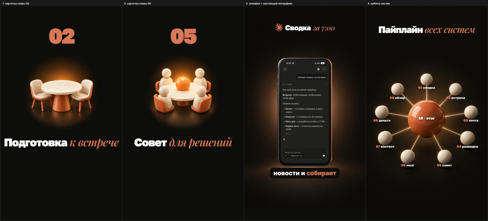
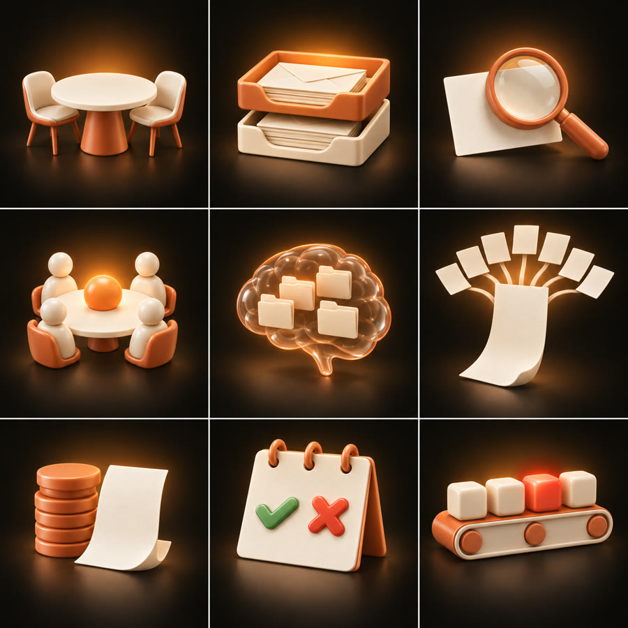

# Генерация картинок для второго захода: gpt-image-2 через подписку Codex

Что генерировать для рилса, как писать промпты и где брать готовые. Генератор — gpt-image-2 через
подписку ChatGPT/Codex (Responses API, инструмент `image_generation`, до 5 референсов, без API-ключа):
[qwwiwi/codex-gpt-image-2-subscription](https://github.com/qwwiwi/codex-gpt-image-2-subscription),
оригинал — [ningzimu/codex-gpt-image](https://github.com/ningzimu/codex-gpt-image).

## Нужна ли генерация вообще

**Не всем.** Если ролик про AI, софт, агентов — экраны, схемы, уведомления, чаты и логотипы
закрываются HyperFrames без генерации (каталог блоков + наши панели, скилл `montage-visual`).
Генерация картинок нужна, когда в ролике надо **показать то, чего нет на экране компьютера**:

| Ниша | Что генерировать | Где брать промпты |
|---|---|---|
| еда, кафе, доставка | фрукты, овощи, шаурма, блюдо «в полёте», ингредиенты | wuyoscar — коммерческие рендеры продуктов и еды, JSON-конфиг (№ 56–58); EvoLink / YouMind — Food, Product |
| недвижимость, брокеры | здание, фасад, интерьер, изометрический разрез дома, план → 3D | wuyoscar — архитектура и интерьеры, изометрия; YouMind — Architecture / Interior |
| товарный бизнес | товар в студии, распаковка, товар в интерьере | wuyoscar — product render config; EvoLink — Product |
| услуги, обучение | объёмные иконки шагов, метафоры процесса | jamez-bondos, ImgEdify — 3D-иконки; наши шаблоны ниже |
| любой ролик | объёмный фон хука, карточки глав | наши шаблоны ниже |

## Главное правило: модель рисует образ, текст и логотипы — мы

- **Кириллица у модели плывёт** («контеит-система» вместо «контент-система») — заголовки, подписи,
  цифры ставим сами в HyperFrames поверх картинки.
- **Логотипы модель рисует «похожими, но не теми»** — настоящие SVG берём из
  [glincker/thesvg](https://github.com/glincker/thesvg) / [gilbarbara/logos](https://github.com/gilbarbara/logos).
- **Экран устройства генерируем пустым**, настоящий интерфейс вставляем сами — экран в ролике не врёт.

## Лучшие источники

| Источник | Что взять |
|---|---|
| [wuyoscar/GPT-Image2-Skill](https://github.com/wuyoscar/GPT-Image2-Skill) · MIT | **методика**: `skills/gpt-image/references/craft.md` — чек-лист промпта; галерея 163 промптов, UI-мокапы № 102–106, изометрия, инфографика |
| [OpenAI Cookbook: image-gen prompting guide](https://developers.openai.com/cookbook/examples/multimodal/image-gen-models-prompting-guide) | официальный порядок промпта, работа с референсами |
| [EvoLinkAI/awesome-gpt-image-2-API-and-Prompts](https://github.com/EvoLinkAI/awesome-gpt-image-2-API-and-Prompts) · CC0 | 462 промпта, `cases/ui.md` — 125+ UI-кейсов, есть русский перевод |
| [YouMind-OpenLab/awesome-gpt-image-2](https://github.com/YouMind-OpenLab/awesome-gpt-image-2) · CC BY 4.0 | ~17 500 промптов, на сайте фильтр App / Web Design |
| [ZeroLu/awesome-gpt-image](https://github.com/ZeroLu/awesome-gpt-image) · MIT | свежие кейсы GPT Image 2 / 2.5, UI/UX, инфографика |
| [jamez-bondos/awesome-gpt4o-images](https://github.com/jamez-bondos/awesome-gpt4o-images) · CC BY 4.0 | 3D-иконки без текста: воксель, бумага, 8-bit |
| [ImgEdify/Awesome-GPT4o-Image-Prompts](https://github.com/ImgEdify/Awesome-GPT4o-Image-Prompts) · MIT | 3D/C4D-иконки, изометрические «коробки в разрезе» |

Почти все UI-промпты в коллекциях рассчитывают на читаемый текст в картинке — для нас берётся
**структура** промпта, а не сам промпт.

## Методика (по craft.md)

1. **Холст и раскладка — до объекта**: «Tall vertical 9:16…», «Square 3×3 grid…», «The TOP 22% is
   completely empty…». Иначе модель тратит детали на объект и импровизирует раскладку.
2. **Материал, свет и палитра — отдельными строками**, не словом «premium»: `Materials: …`,
   `Lighting: softbox upper-left, warm rim light…`, `Palette: charcoal #0E0D0C…`. Цвет — словом и hex.
3. **Одна крупная объёмная форма** держит кадр лучше, чем много мелких; **явно назвать пустое место**
   под заголовок.
4. **Наборы — одним листом** (`3×3 grid`, общее art direction, роль каждой клетки): стиль держится
   заметно лучше, чем по одной картинке. Потом лист режется.
5. **Референсы по номеру и роли**: «Image 1 is the STYLE REFERENCE: copy its material, shading,
   lighting, colours». Лучшая одобренная картинка — якорь стиля для следующих.
6. **Запреты короткие и в конце**: `No text, no letters, no numbers, no logos.` Вместо «lines of text»
   — «solid rounded capsules», иначе появляются каракули.
7. UI-промпт пишется как спецификация продукта (устройство, раскладка экрана, компоненты) — но у нас
   без надписей: плашки-заглушки вместо текста.

## Шаблоны под наш стиль

Палитра: clay `#D97757`, charcoal `#0E0D0C`, cream `#F3EDE6`. Хвост каждого промпта:
`No text, no letters, no numbers, no logos.`

| Шаблон | Промпт (скелет) | Куда в ролике |
|---|---|---|
| Объёмный фон хука | `…ONE large glossy sculpture of [form] in clay #D97757 … in the RIGHT THIRD; the LEFT TWO THIRDS clean empty charcoal #0E0D0C…` | панель хука, обложка первого кадра |
| Иконка шага | `Premium 3D glossy icon, centered. ONE object: [object]. Soft studio light, contact shadow, charcoal background with soft warm glow…` | карточка главы, панель шага |
| Набор иконок 3×3 | `Square canvas, a 3×3 grid… Image 1 is the STYLE REFERENCE… SHARED ART DIRECTION… TILES: 1) … 9) …` | все шаги одним стилем |
| Телефон с пустым экраном | `Tall 9:16. TOP 22% empty. One smartphone floating… facing the camera STRAIGHT ON… screen a flat uniform dark surface, no UI…` | врезка «визуал во весь экран», в экран — настоящий интерфейс |
| Орбита агентов | `…one large glossy clay sphere, around it [N] smaller cream spheres on an orbit ring, thin glowing lines…` | «итог всей работы», хук про N систем |
| Стеклянные карточки дашборда | `Cluster of [4–6] frosted-glass cards; each has one abstract chart shape in #D97757; labels replaced by blank capsules.` | шаг про деньги, аналитику |
| Чат / уведомления | `Vertical stack of chat bubbles / notification cards filled with solid rounded capsules, not text…` | шаги про почту, переписку |
| Ноутбук с пустым экраном | `Open laptop, front 3/4 view, screen a perfectly flat uniform #0E0D0C, no UI.` | десктопные интерфейсы |

## Проверено на ролике «10 систем в Claude»

- **Набор 3×3 с референсом стиля** дал 9 иконок того же материала, света и ракурса, что и одобренная
  первая — одним листом, без единой буквы. Лист режется на клетки (ffmpeg `crop`).
- **Телефон «прямо в камеру» с пустым экраном** — экран получается ровным прямоугольником: границы
  находятся по яркости пикселей, настоящий интерфейс ставится в него без искажений.
- **Точное число объектов модель не держит**: просили 10 спутников на орбите — пришло 9. Обыграли:
  9 систем вокруг, десятая — «итог» в центре. Число объектов проверять глазами после генерации.

## Ловушки

- **Размер и качество через подписку не соблюдаются** (открытый баг
  [openai/codex#28723](https://github.com/openai/codex/issues/28723)): приходит ~1,5 Мп в своих
  пропорциях — «landscape» вернулся 941×1672. Пропорцию писать в тексте промпта, фактический размер
  проверять после генерации, недостающее достраивать фоном того же hex.
- **Наш форк отстаёт от оригинала**: upstream перешёл на `gpt-image-2.5-flare` (качество `xhigh`/`max`,
  прозрачный фон). Бэкенд подписки не возвращает фактический ID модели.
- **Параллельные генерации затирают друг друга**: скрипт называет файл `img_<секунды>.png`, две
  генерации, закончившиеся в одну секунду, пишут в один файл — одна картинка потеряна. Запускать по
  одной или сразу копировать результат под своим именем, пока не пришла следующая.
- **1080×1920 недопустимо в API** (стороны кратны 16): 1088×1920 или 1152×2048 с кадрированием.
- Лицензия файла из коллекции ≠ права на изображённое: реальные бренды и лица — не просить.
