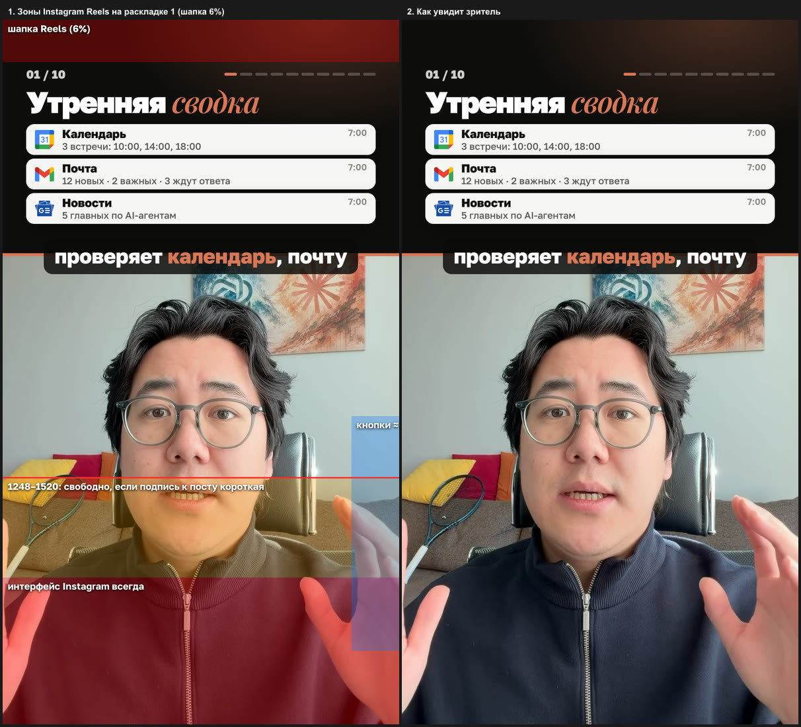
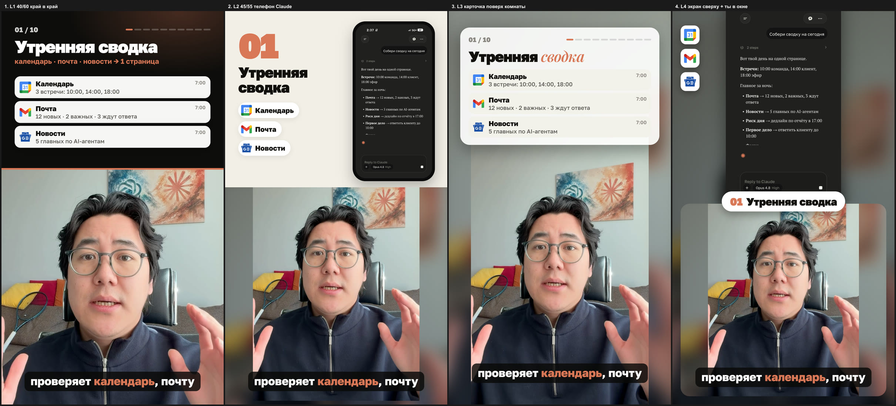
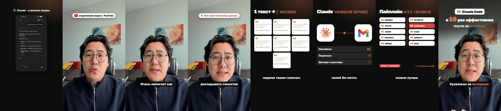

# Второй заход: визуализация рилса

Первый заход (скилл `montage-pipeline`) отдаёт замороженный чистовик: паузы и дубли вырезаны,
длина доказана. Второй заход рисует поверх: хук, панели шагов, субтитры, логотипы, призыв.
Рендер — [HyperFrames](https://github.com/heygen-com/hyperframes) (Apache-2.0): HTML-страница плюс
остановленная временная шкала GSAP → MP4 через headless Chrome.

> **Второй заход не двигает ни одной склейки.** Длительность до и после сверяется до кадра;
> любое расхождение — отказ, а не округление. Громкость и битрейт — после второго захода, в выдаче
> (см. `montage-pipeline`).

> **Журнал ошибок — [`docs/errors.md`](../../docs/errors.md).** Прочитай его перед началом работы.
> Нашёл новую проблему — сразу допиши запись (где · симптом · причина · исправление · правило ·
> статус), не откладывая на конец: база ошибок копится, чтобы следующий ролик собирался быстрее.

---

## Формат кадра и безопасные зоны Instagram Reels

Кадр 1080×1920, 30 к/с. Поверх ролика Instagram кладёт свой интерфейс:

| Зона (y, px) | Что там | Правило |
|---|---|---|
| 0–115 (верхние **6%**) | шапка Reels, иконка камеры | ничего важного; только фон |
| 115–1248 | безопасно | весь текст, логотипы, лицо |
| 1248 | **безопасная линия** | ниже неё текст может перекрыться |
| 1248–1520 | свободно, только если подпись к посту короткая | лицо допустимо, текст — нет |
| 1520–1920 | интерфейс Instagram **всегда**: ник, подпись, звук | ни текста, ни рта, ни подбородка |
| справа ≈ x 950–1080, y 1080–1720 | колонка кнопок: лайк, комментарий, репост | ни текста, ни важных деталей |

Шапка — **6%, решение владельца 22.09.2026**: консервативная рекомендация Meta (14%, 270 px)
отдавала шапке слишком много места, и панель шага не помещалась. Правая колонка дана
**примерно** — сверь по скриншоту своего рилса из приложения Instagram.



**Перед каждым рендером** снимай проверочный кадр с нанесёнными зонами — отдельная копия
композиции с полупрозрачными слоями поверх (код ниже). Глазом, по картинке, а не по памяти.

---

## Раскладка 1: экран сверху, спикер снизу (утверждена 22.09.2026)



Выбран L1: панель шага сверху, спикер снизу **во всю ширину, край в край, без уменьшения и без
размытых полей**. Размытые бока и низ владелец отверг. Снизу спикера можно подрезать — только
корпус; голову и плечи — никогда.

### Замеры головы — на каждом дубле заново

Сними кадр чистовика с сеткой через каждые 100 px исходника и запиши в пикселях исходника:
макушку (верх волос), подбородок, плечи.

```bash
ffmpeg -v error -y -ss 4.5 -i чистовик.mp4 -frames:v 1 -vf "scale=540:960,drawgrid=w=540:h=50:t=1:c=red@0.6" кадр-сетка.png
```

Эталонный дубль: макушка **610**, подбородок **1380**, плечи 1300–1400.

### Расчёт раскладки

- **Первая видимая строка исходника** `y0 = макушка − воздух`; воздух **80 px** (над головой видна
  стена и картина — владелец выбрал именно такой кадр).
- **Шов** (граница панели и спикера) ставится так, чтобы **подбородок лёг выше 1520** с запасом,
  а рот — около безопасной линии: `шов ≈ 1490 − (подбородок − y0)`. На эталоне: `y0 = 530`,
  шов **640** → глаза ≈1110, рот ≈1320, подбородок ≈1490. Снизу срезано 110 px корпуса.
- Шов на 770 даёт тот же кадр спикера, но подбородок уходит на ~1620 — под ник и подпись. Не
  ставь шов ниже, чем даёт формула.
- Шов — оранжевая линия 8 px цвета Claude (`#D97757`).

```css
#face { position:absolute; left:0; width:1080px; top:640px; height:1280px; overflow:hidden; }
#face video { position:absolute; left:0; top:-530px; width:1080px; height:1920px; object-fit:cover; }
```

Обёртка `#face` — **нетаймированная**: `data-start` только на `<video>` (см. ловушки).

### Панель шага

Полоса **115 … шов − 50** (на эталоне 115–590). Всё, что важно, — внутри неё; между последним
блоком панели и строкой субтитров на шве — просвет, проверяется на кадре с зонами.

- строка: `01 / 10` слева + шкала прогресса из 10 делений справа (горит столько, сколько шагов
  пройдено);
- заголовок шага: Golos Text 900, акцентное слово курсивом Playfair Display цвета Claude
  («Утренняя *сводка*»);
- визуальный блок шага: компактный, в одну-две строки высоты (карточки-уведомления с логотипами,
  чипы, мини-таблица, чек-лист, схема) — панель низкая, телефон целиком в неё не влезает;
- фон панели: тёмный `#0E0D0C` с мягким бликом цвета Claude.

Панель шага появляется на **произнесённом номере шага** («Первая…», «Вторая…») — тайминг берётся
из распознавания чистовика, не на глаз.

### Субтитры — на шве

При разделённом экране субтитры стоят **на шве** (на эталоне y ≈ 600–680): внутри безопасной
зоны, над макушкой, ни на что не наезжают. Канон `captions.py` (строка на 1400) здесь не годится —
легла бы на рот.

- вспышки по 2–3 слова, тёмная плашка `rgba(10,9,8,.82)`, Golos 800, акцентные слова цветом Claude;
- текст — из повторного распознавания чистовика; правка отдельного слова разрешена («код» →
  «Claude», «мост» → «мозг»), замена фразы — нет;
- в окне призыва субтитры **гаснут**: одно сообщение на кадр.

---

## Динамика кадров: сплит, визуал во весь экран, спикер во весь экран

Статичный кадр спикера на весь ролик — скучно, даже если панель сверху меняется. Эталон — рилс
владельца, смонтированный человеком (`instagram.com/reel/DdL-LKOMFIH`, 30 с, 9 склеек):

- основа — сплит 50/50, визуал сверху, спикер снизу, короткие субтитры на шве;
- визуал сверху меняется **каждые 0,5–2 с** — на каждую новую мысль свой экран;
- **визуал во весь экран на 1,5–3 с**, спикера нет, голос идёт — 3 раза за 30 с;
- **спикер во весь экран на ~1 с**, другой план — эмоциональный акцент;
- смена раскладки **примерно каждые 3 с**, только жёсткие склейки, без переходов;
- кодовое слово крупно на шве поверх визуала.



### Три типа кадра

| Тип | Что в кадре | Когда ставить | Длина |
|---|---|---|---|
| **С — сплит** | панель шага сверху, спикер снизу (раскладка 1) | основа ролика | остальное время |
| **В — визуал во весь экран** | экран без спикера: телефон с Claude, веер постов, крупные логотипы со связью, схема систем | на результате, который надо увидеть целиком: «собирает одну страницу», «посты на неделю», «привязываю к почте», «полный пайплайн» | 1,5–4 с |
| **Т — спикер во весь экран** | исходный кадр целиком + плавный наезд 100 → 107% | личные фразы и эмоция: «я обычно…», «очень помогает…», «не рекомендую…», призыв | 1–4 с |

Ритм на 59-секундном ролике: 4 врезки «В», 4 врезки «Т», смена раскладки каждые 2–5 с.
Своего второго ракурса у одной камеры нет — «другой план» делается наездом на тот же кадр.

### Как это устроено

- **Т** — отдельный клип того же замороженного чистовика поверх сплита, с точным смещением:
  `<video id="fsN" src="plate.mp4" data-start="A" data-duration="D" data-media-start="A" muted>`.
  Звук один на весь ролик (`<audio>`), поэтому синхрон не уезжает. Наезд — GSAP `scale` на клипе,
  точка опоры **ниже рта** (`transform-origin: 540px 1300px`), чтобы подбородок не уходил под
  субтитры.
- **В** — полноэкранная сцена 1080×1920 с непрозрачным фоном поверх сплита (`z-index` выше).
  Содержимое — в полосе 115–1248, заголовок сцены в одну строку (`white-space: nowrap`).
- Поверх **Т** — только то, что не закрывает лицо: пилюля-плашка над головой (y≈230), для призыва —
  затемнение верхней трети и блок «Claude Code ×10».
- **Субтитры переезжают по типу кадра**: в «С» — на шве, в «Т» — под подбородком (y≈1410, в полосе
  1248–1520), в «В» — под визуалом (y≈1300). Слой субтитров — **выше всех врезок** (`z-index: 30`).
- **Группа субтитров не пересекает склейку**: на моменте смены кадра группа рвётся, и её показ не
  тянется за склейку — иначе строка переедет посреди фразы.
- **Проверка синхрона врезок «Т» после рендера:** SSIM области лица готового ролика против
  чистовика в тот же момент и со сдвигом ±0,5 с (первые кадры врезки, пока наезд ≈100%). На этом
  ролике: тот же момент 0,67–0,93, сдвиг 0,37–0,62 — синхрон точный. Если «тот же момент» не выше
  сдвигов — клип взят без `data-media-start`.
- План врезок — таблица «от — до — тип — что» в генераторе композиции; каждая граница стоит на
  слове из распознавания, а не на глаз.

## Хук

- **Правило владельца, всегда: заголовок и логотип целиком видны на ПЕРВОМ кадре (кадр 0).**
  Никакой сборки по словам, никакого влёта логотипа: пока хук «печатается», зритель теряет доли
  секунды, не понимает, о чём ролик, и уходит. Хук должен бросаться в глаза сразу — он же обложка
  первого кадра.
- Заголовок = главное обещание ролика; логотип бренда, о котором ролик, — рядом с его названием
  (владелец: «чтобы сразу ассоциировали с Claude»).
- Движение — только поверх уже видимого: короткая вспышка слова (масштаб 1 → 1,08 → 1 за 0,28 с)
  в момент, когда оно звучит, медленное вращение знака. Прозрачность хука с кадра 0 — 100%.
- Проверка: снимок на `--at 0` — весь заголовок и логотип читаются.
- Хук уходит до того, как прозвучит первый шаг.
- Стиль хука выбирается сравнением: собери 2–3 варианта и сними один лист
  `hyperframes compare вариантA вариантB вариантC --at <секунда> --labels ...`.

## Призыв с кодовым словом

- Кодовое слово — **из речи автора** («Пиши слово „выходные“ в комментариях»), не придумывается.
- Крупное слово в тёмной пилюле + звёздочка/логотип, строка «напиши в комментариях» над ним.
- Ставится **в безопасной зоне** (панель или выше 1248) — не в нижней трети, где его закроет
  подпись к посту.
- Входит на произнесённом «пиши слово…» и держится до конца; субтитры в этом окне выключены.

---

## Где брать экраны и UI-компоненты

### 1. Каталог HyperFrames — основа

`hyperframes catalog --json` (380+ элементов), установка `hyperframes add <имя> --no-clipboard`.
Блоки кладутся в `compositions/`, настраиваются через переменные.

| Экран | Блок каталога |
|---|---|
| диалог Claude (мобильный, 1080×1920) | `claude-exchange` |
| терминал Claude Code | `code-terminal-run`, `terminal-simulator`, `typed-prompt` |
| уведомления, сводка | `notification-cascade`, `notification-stack`, `native-notification-pop` |
| переписка, спор ролей | `chat-thread`, `message-thread-reveal`, `thread-message-stack`, `typing-indicator` |
| заметки, база знаний | `notes-reveal`, `notes-typing` |
| деньги, графики | `apple-money-count`, `count-up`, `bar-chart-race`, `chart-story` |
| чек-лист, статусы | `marker-checklist-card`, `success-check`, `state-chip-rail` |
| схема систем | `flowchart-vertical`, `hw-pipeline`, `constellation-hub` |
| сетка карточек, логотипы | `grid-card-assemble`, `logo-wall`, `logo-sting` |
| посты | `x-post`, `reddit-post`, `instagram-follow` |
| рамки устройств | `device-frame-stage`, `browser-device-stage`, `multi-device-splay` |

Блоки 1920×1080 (`flowchart`, `x-post`, `code-snippet-*`) перекомпоновывай под вертикаль.

### 2. Приложения, которых нет в каталоге

Собираются заранее в **статический HTML + CSS** (Vite + React → `renderToStaticMarkup`,
Tailwind через `@tailwindcss/cli` в один файл), встроенные анимации выключены, вся анимация — GSAP.
React в композицию не попадает.

| Экран | Источник | Лицензия |
|---|---|---|
| ящик в стиле Gmail | [shadcn/ui](https://github.com/shadcn-ui/ui), пример Mail (`v3.shadcn.com/examples/mail`, тег `shadcn@2.1.8`), блок `sidebar-09` | MIT |
| календарь, вид дня | [lramos33/big-calendar](https://github.com/lramos33/big-calendar) | MIT |
| финансы, KPI, таблицы | [Tremor](https://github.com/tremorlabs/tremor) и Tremor Blocks | Apache-2.0 |
| задачи, канбан | shadcn Tasks, [Dice UI](https://github.com/sadmann7/diceui) | MIT |
| граф систем | [xyflow / React Flow](https://github.com/xyflow/xyflow) | MIT |
| чат-интерфейсы | [Vercel AI Elements](https://github.com/vercel/ai-elements), [assistant-ui](https://github.com/assistant-ui/assistant-ui) | Apache-2.0 / MIT |

**Код не берём:** React Bits (MIT + Commons Clause — нельзя перераспространять), Aceternity
(лицензия бесплатной части не подтверждена), официальные клиенты Telegram (GPL-3.0), мелкие клоны
Telegram и Календаря без лицензии. Живые анимации Magic UI / Aceternity идут в реальном времени, а
не по кадрам — от них берём только внешний вид.

### 3. Логотипы

| Источник | Что | Лицензия файлов |
|---|---|---|
| [glincker/thesvg](https://github.com/glincker/thesvg) | 5886 брендов, фирменные цвета и моно | MIT |
| [gilbarbara/logos](https://github.com/gilbarbara/logos) | цветные: `google-gmail`, `google-calendar`, `claude-icon`, `claude-code` | CC0 |
| [simple-icons](https://github.com/simple-icons/simple-icons) | одноцветные; у 223 иконок своя лицензия — проверяй | CC0 |

Логотип вставляется **инлайн-SVG** (без сети при рендере). Лицензия файла — только авторское право
на SVG: товарный знак ставится, чтобы обозначить сервис, о котором речь, без намёка на партнёрство.

### 4. Скринкасты конкурентов — точечно

Если нужен живой экран, а не рисунок:

- ищи по **теме шага** (Gmail, Календарь, почта, заметки…), а не по залёту вообще: кадр обязан
  совпадать с тем, что говорит автор;
- экран с интерфейсом ChatGPT / Codex / Gemini на шаге «система в Claude» — отказ;
- только авторы, чьё разрешение получено; вне этого списка — не брать;
- у конкурентов поверх экрана почти всегда впечатаны их субтитры и значки: вырезается полоса экрана
  между ними, ники и личные данные — размыть;
- скачивание и нарезка: Loore `download_instagram_media` → кадры каждые 0,5 с → вырез с
  кадрированием и размытием по спецификации.

Референсы хуков: база конкурентов в Loore, отбор по залёту **относительно медианы автора**, затем
**отдельный фильтр по качеству графики**: по одному залёту в топ выходят визуально бедные ролики
(белая плашка Instagram), это учит утверждению, а не оформлению.

---

## Сборка

- Композиция генерируется кодом из файла слов и таймкодов шагов, а не пишется руками: субтитров
  десятки групп, каждая привязана к измеренному слову.
- Шрифты — локальными файлами с `@font-face`: Golos Text (вариативный, объявлять
  `font-weight: 100 900`), Playfair Display Italic для акцента, PT Serif для «ответа Claude».
  Без `@font-face` headless-браузер молча подставит свой.
- GSAP — локальной копией (`vendor/gsap.min.js`), не с CDN: рендер без сети.
- Потоки рендера — явно: `-w 3` (или по числу ядер), `auto` выбирает один.

### Проверочный слой зон (копия композиции, в рендер не идёт)

```html
<style>.gd{position:absolute;z-index:50}.gd b{position:absolute;left:14px;top:8px;color:#fff;font:700 26px sans-serif}</style>
<div class="gd" style="left:0;right:0;top:0;height:115px;background:rgba(255,0,0,.28)"><b>шапка Reels 6%</b></div>
<div class="gd" style="left:0;right:0;top:1248px;height:272px;background:rgba(255,160,0,.26)"><b>1248–1520</b></div>
<div class="gd" style="left:0;right:0;top:1520px;bottom:0;background:rgba(255,0,0,.34)"><b>интерфейс всегда</b></div>
<div class="gd" style="right:0;width:130px;top:1080px;height:640px;background:rgba(0,120,255,.3)"><b>кнопки ≈</b></div>
```

### Гейт перед рендером

1. `hyperframes lint` — 0 ошибок (ошибка линта выключает аудиты раскладки — `0 sample(s)` не
   значит «чисто»).
2. `hyperframes check` — наложения и контраст.
3. `hyperframes compare` / `snapshot` — проверочный кадр с зонами на каждом шаге: панель, шов,
   субтитры, лицо.
4. После рендера: длительность = длительность чистовика до кадра.

---

## Ловушки, найденные на живой сборке

- **Кириллица кракозябрами в блоках каталога.** Блок кладёт переменные JSON-ом в тег `<html>`,
  `<meta charset>` уезжает дальше первых 1024 байт — браузер читает страницу как Latin-1. Пиши
  значения переменных ASCII-эскейпами (`\uXXXX`), убери комментарий перед `<!doctype>`.
- **Шрифты блоков латинские** (Inter, EB Garamond в `claude-exchange`). Подменяй `@font-face` на
  Golos Text и PT Serif, иначе кириллица уйдёт в чужую гарнитуру.
- **`data-start` на `<video>` и на его обёртке одновременно** — экстрактор и окно видимости
  расходятся: не те кадры, потом клип пропадает. Время — только на видео, обёртка нетаймированная.
- **`<video>` без `id` замерзает в рендере.** Каждому медиа — свой `id`.
- **`<audio>` без `id` не попадает в микшер** — рендер немой.
- **Эмодзи в headless Chrome** рисуются чужими глифами. Не использовать или ставить картинкой.
- **Субтитры по канону 1400 при разделённом экране** ложатся на рот — на шов.
- **Шапка шага на y≈70** — под шапкой Reels. Содержимое панели — с 115.
- **Двухстрочные карточки выше, чем кажется по кеглю**: третья карточка заехала под субтитры на
  шве. Меряй на кадре, а не в уме.
- **Первая версия раскладки клала субтитры на 1760–1840** — в зону, которую интерфейс закрывает
  всегда. Проверочный кадр с зонами ловит это за секунду.
- **Размытые поля вокруг уменьшенного спикера** владелец отверг: спикер край в край, подрезается
  снизу, а не уменьшается.
- **Хук, собирающийся по словам,** съедает первые 2 секунды: на кадре 0 пусто, зритель уходит, не
  поняв обещания. Заголовок и логотип — целиком с кадра 0 (журнал ошибок, E22).
- **Субтитры под полноэкранными врезками**: слой субтитров был ниже слоёв «В» и «Т» — на врезках
  их не было видно. Субтитры — самый верхний слой.
- **Таймкоды распознавателя бывают немонотонными** («почте.@37,06 Он@36,98»): сортировка слов по
  времени перемешала фразу в «своей Он почте». Порядок слов — как отдал распознаватель.
- **Плашка в строке заголовка шага** налезает на заголовок: ширина заголовка зависит от слова.
  Итог шага — отдельной карточкой поверх виджета, источники уходят на второй план.
- **Субтитр на шве в две строки** падает на макушку. Группа — не длиннее 24 символов, одна строка.
- **zsh в однострочниках**: `set -- $pair` не делит слова, `$i:l` — модификатор переменной.
  Циклы и сборку фильтров — в bash или Python.
- **Число с потолка в мокапе** — только как иллюстрация системы, о которой речь; в субтитрах и
  кодовом слове — только сказанное автором.
